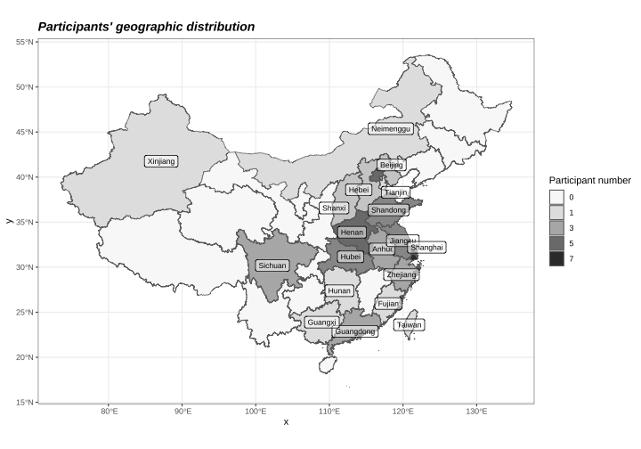

# Design overview

This page provides a general description of the MELI corpus and its recruitment process. All data was collected in person between February 2024 and April 2024 at [the Speech-in-Context Lab](https://speechincontext.arts.ubc.ca/) at [the University of British Columbia](https://linguistics.ubc.ca/).

## A bilingual interview corpus for qualitative and quantitative analysis

The goal for developing this corpus comes in two-fold: (1) providing high quality recordings that allow acoustic analysis of Mandarin-English bilingual speech, and (2) providing interview contents that can be qualitatively analysed to provide a definition for "standardness" in English and Mandarin.

The Mandarin-English Language Interview (MELI) Corpus includes read sentences and semi-structured interviews from 51 Mandarin-English bilinguals (26 women and 25 self-identified men). Each participant completed one interview in Mandarin and one in English, each lasting approximately 20 to 30 minutes, with both interviews conducted by the same Mandarin-English bilingual interviewer. All recordings are fully transcribed and force-aligned, enabling acoustic and thematic analysis in its current form.

## Participants and recruitment

The corpus consists of speech of 51 Mandarin-English bilinguals (26 women and 25 men). Participants were coded with the following structure: identified gender (F or M), last two digits of their year of birth, and a unique letter to differentiate between participants with same identified gender and age. For example, F00A represents a female-identifying participant who were born in the year 2000. 

Participants were recruited through a variety of methods including posts on the UBC Psychology Paid Studies List, posts on the UBC Graduate Student Community forum, posts on social media, printed flyers, and word of mouth. The recruitment criteria include the following:

1. living in Metro Vancouver at the time of the interview
1. born and raised in mainland China
1. have taken the TOEFL/IELTS exam
1. having attended or currently attending university in an English-speaking country

One goal of this corpus is to include speakers of different Mandarin varieties. The figure below shows a distribution of the geographical locations that speakers identify with by province. A detailed summary of the participants' language background information is provided in the [corpus download](4-download.md).

