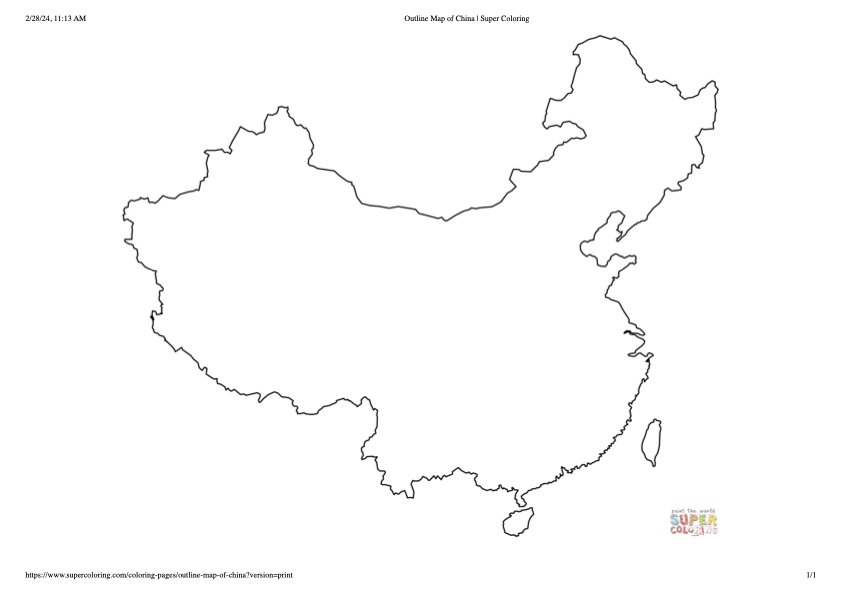

# Recording session procedures

## Overview

After signing the consent form, the audio release form and completing the language background questionnaire, participants were given a quick walk-through of the procedure of the interview. This walk-through verbally (1) went over the general procedure of the recording session, (2) reassured participants that they did not need to answer questions they felt uncomfortable with, and they could withdraw from the study at any point without any consequences, and (3) they could redact any part of the interview before the release of the corpus. Participants then completed two recording sessions in Mandarin and English in one sitting. 

Each recording session began with a sentence-reading task, followed by a 20--30 minute interview. Participants first familiarized themselves with the sentences before reading them aloud. After completing the reading task, participants took part in a bilingual interview. The goal of the interview was to elicit their definitions of and attitudes toward "standard" Mandarin and English. Both components were recorded in a single audio file for each participant. In the finalized corpus, the audio file was segmented by language session.

## Recording setup

The recording sessions were conducted in a quiet room in Stores Road Annex at the University of British Columbia with the interviewer, Suyuan Liu. The participant and interviewer were seated across a table.

### Tools & equipment

- [Audacity 3.0 (and above)](https://www.audacityteam.org/)
- A PC computer
- Sound Devices USBPre2 Portable Audio Interface
- the SHURE WH20XLR headworn dynamic microphones (placed roughly 3 cm from the corner of the mouth for the interviewer and the participant)

### Settings

- Stereo (L: participant, R: interviewer)
- 44.1 KHz sampling rate
- 16-bit resolution

## Task 1: Sentences

The primary goal for the sentence reading task is to collect auditory stimuli for a follow-up sentence-in-noise trancription study. The reading materials were hence selected for this purpose. Each participant was assigned two lists of Mandarin sentences and two lists of English sentences. They were instructed to read each sentence twice. _Note: The first 5 participants (F89A, F94A, M97A, M01A, M99A) only read each sentence once._

### Mandarin Sentences

The Mandarin sentences were 10 lists of the [Mandarin speech perception (MSP) sentence test materials (Fu et al., 2011)](https://pubs.aip.org/asa/jasa/article-abstract/129/6/EL267/833509/Development-and-validation-of-the-Mandarin-speech?redirectedFrom=fulltext) presented in simplied Chinese characters. The table below shows the first Mandarin setence list with [Pinyin](https://en.wikipedia.org/wiki/Pinyin) and English translations. The full list can be found [here](sentence_man.md).

| # | Mandarin Sentence | Pinyin | English Translation |
| --- | --- | --- | --- |
| 1 | 今天的阳光真好 | Jīntiān de yángguāng zhēn hǎo | The sunlight is lovely today. |
| 2 | 节假日不用门票 | Jiéjiàrì bú yòng ménpiào | No ticket is needed on holidays. |
| 3 | 晚上一块去跳舞 | Wǎnshang yíkuài qù tiàowǔ | Let’s go dancing tonight. |
| 4 | 对面有两所高中 | Duìmiàn yǒu liǎng suǒ gāozhōng | There are two high schools over there. |
| 5 | 这些衣服洗过吗 | Zhèxiē yīfu xǐ guò ma | Have these clothes been washed? |
| 6 | 北京近来很寒冷 | Běijīng jìnlái hěn hánlěng | Beijing has been very cold lately. |
| 7 | 他家每年放鞭炮 | Tā jiā měinián fàng biānpào | His family sets off firecrackers every year. |
| 8 | 外孙出生在农村 | Wàisūn chūshēng zài nóngcūn | The grandson was born in the countryside. |
| 9 | 星期二别打篮球 | Xīngqī’èr bié dǎ lánqiú | Don’t play basketball on Tuesday. |
| 10 | 短裙长度正合适 | Duǎnqún chángdù zhèng héshì | The skirt length is just right. |

### English Sentences

The English sentences were 10 lists selected from the [English Hearing In Noise Test (HINT) list (Nilsson, 1994)](https://pubs.aip.org/asa/jasa/article-abstract/95/2/1085/831029/Development-of-the-Hearing-In-Noise-Test-for-the). The table below shows the first English setence list. The full lists and selection criteria can be found [here](sentence_eng.md).

| #   | List 1                           |
| --- | -------------------------------- |
| 1   | The fruit is on the ground.      |
| 2   | They followed the garden path.   |
| 3   | They like orange marmalade.      |
| 4   | There were branches everywhere.  |
| 5   | The kitchen sink is empty.       |
| 6   | The old gloves are dirty.        |
| 7   | The scissors are very sharp.     |
| 8   | The man cleaned his suede shoes. |
| 9   | The raincoat was dripping wet.   |
| 10  | It’s getting cold in here.       |

## Task 2: Interview

The interview languages were counterbalanced and can be found in the [metadata document](MELI_metadata_LBQ.tsv). No instructions or comments regarding participants' speaking style were given in order to ensure comfort and naturalness during the interview. In particular, no guidance was provided about code-switching or the use of a specific Mandarin variety. 

### Mandarin Interview

The Mandarin interview focused on two main topics: (1) eliciting participant's attitude towards Mandarin varieties, Chinese languages, and Standard Mandarin through their experience and (2) reflecting on participant's impression of their voice. A [draw-a-map task](https://onlinelibrary.wiley.com/doi/10.1002/9781118827628.ch10) was conducted during the discussion of the Mandarin and Chinese language landscape, where participants were asked to circle the geographical regions that speak the "most standard" and "least standard" Mandarin. The image below shows the empty map used in this task. A full list of sample questions can be found here: [Mandarin interview questions PDF](MELI_interview_questions_man.pdf).

### English Interview

The English interview focused on (1) participant's experience learning English and their attitude towards different English varieties, and (2) their reflection on how their voices differ across languages, if at all. A full list of sample questions can be found here: [English interview questions PDF](MELI_interview_questions_eng.pdf).
