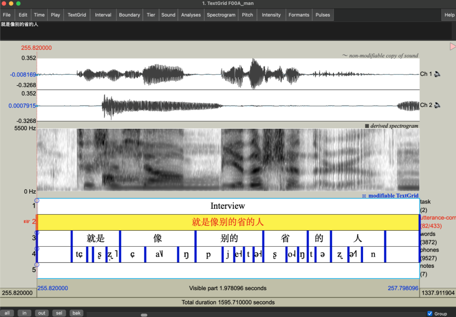
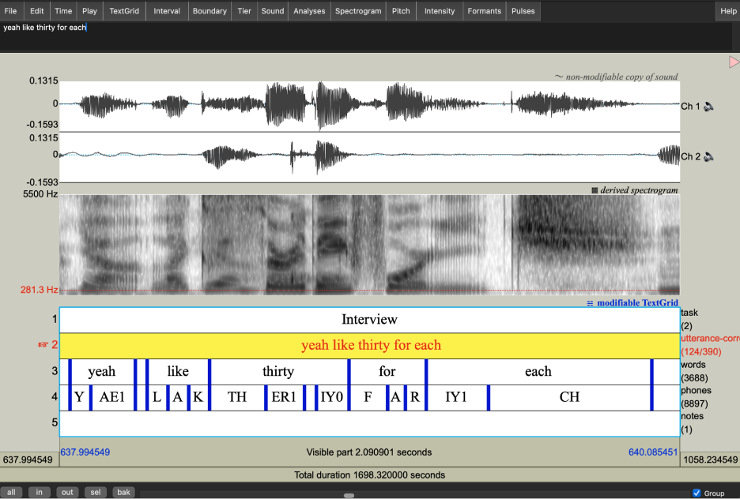

# Transcription procedures

## Overview

For now, only the partcipant's data is fully transcribed and force-aligned. Transcription and forced-alignment of the interview data started in May 2024 and was completed in October 2024.

Broadly, the transcription pipeline followed these steps:

1. Extraction of participant's channel and file segmentation by language
2. Initial transcripts using Whisper text-to-speech model
3. Hand-correction of orthographic transcripts by bilingual research assistants
4. Phone-level forced alignments

The tools used in the process were:

- [Praat](https://www.fon.hum.uva.nl/praat/) (version 6+)
- Python libraries:
    * [`parselmouth`](https://parselmouth.readthedocs.io/)
    * [`audiolabel`](https://github.com/rsprouse/audiolabel)
    * [`jieba`](https://github.com/fxsjy/jieba)
    * ...and others
- [Whisper text-to-speech model](https://huggingface.co/openai/whisper-large-v3) (whisper-large-v3)
- [ELAN](https://archive.mpi.nl/tla/elan) (version 6.7)
- [Montreal Forced Aligner](https://montreal-forced-aligner.readthedocs.io/en/latest/) VERSION NUMBER

## 1+2. Recording processing and automatic transcription:

The Whisper model was used to transcribe both English and Mandarin interviews. Whisper is a pre-trained, Transformer-based sequence-to-sequence model trained for either speech recognition or a combination of speech recognition and speech translation. For this corpus, the multilingual [`whisper-large-v3`](https://huggingface.co/openai/whisper-large-v3) model was selected, as it was the most current and suitable model for transcribing multilingual data at the time.

Interview recordings were first segmented by language (Mandarin vs. English) using PRAAT. The Mandarin and English sound files were transcribed separately. Each language-specific segment was extracted as a WAV file containing only the participant's audio channel, which was then processed by the Whisper model. A customized Python script facilitated the transcription process. The relevant code chunk or English transcription is pasted below as an example, including the pipe structure and settings of hyperparameters, which took reference from [the documentation](https://huggingface.co/openai/whisper-large-v3) of whisper-large-v3 model. The transcription outputs, including by-utterance timestamps, were saved in CSV format. These output CSV files were converted to TextGrid using [ELAN](https://archive.mpi.nl/tla/elan) (version 6.7) for hand correction.

```python
import os
import csv
import torch
from transformers import AutoModelForSpeechSeq2Seq, AutoProcessor, pipeline
from datasets import load_dataset

#set device to cpu
device = "cuda:0" if torch.cuda.is_available() else "cpu"
torch_dtype = torch.float16 if torch.cuda.is_available() else torch.float32

#load model
model_id = "openai/whisper-large-v3"
model = AutoModelForSpeechSeq2Seq.from_pretrained(
    model_id, torch_dtype=torch_dtype, low_cpu_mem_usage=True, use_safetensors=True
)
model.to(device)

#load processor
processor = AutoProcessor.from_pretrained(model_id)

#load pipe structure
pipe = pipeline(
    "automatic-speech-recognition",
    model=model,
    tokenizer=processor.tokenizer,
    feature_extractor=processor.feature_extractor,
    max_new_tokens=128,
    chunk_length_s=30,
    batch_size=16,
    return_timestamps=True,
    torch_dtype=torch_dtype,
    device=device,
)

directory = "ENGLISH_INTERVIEW_DIRECTORY"
transcription_dir = "ENGLISH_TRANSCRIPTION_DIRECTORY"

# loop through English interview directory
for file in os.listdir(directory):
    filename = os.fsdecode(file)
    if filename.endswith("wav"):
        print(f"Start transcription for file {filename}.")
        result = pipe(os.path.join(directory, filename), generate_kwargs={"language": "english"}, return_timestamps=True)

        #save transcription by sentence
        with open(os.path.join(transcription_dir, filename).split(".")[0]+".csv", "w+") as f:
            dict_writer = csv.DictWriter(f, result["chunks"][0].keys())
            dict_writer.writeheader()
            dict_writer.writerows(result["chunks"])

        print(f"Finished transcription for file {filename}.")
        continue
    else:
        continue
```

## 3. Orthographic hand correction:

Each TextGrid file contains four tiers during hand correction: (1) task (sentence reading vs. interview), (2) automatic transcription by Whisper, (3) corrected transcription and (4) notes. Research assistants revised the Whisper-generated transcriptions in the corrected transcription tier and added notes in the notes tier. Notes included flagged identifying information and content participants requested to be redacted.

### Conventions

#### General conventions:

- **Unintelligible speech** was transcribed as "xxx".

- **Punctuations:**
    * Questions were marked with "?"
    * Possessives were marked with an apostrophe (" ' ")
    * Other punctuation was avoided

- **Speech fragments:**
    * annotated using "&" followed by English orthography or Pinyin (e.g., ""..&con confident...")

- **Code-switches and Style Changes:**
    * labelled with "@" followed by description (e.g. @e for code-switches to English).
    * For all labels click [here](cs-table.md)

- **Numbers** were spelled out (e.g. "a hundred" for 100).
- **Other non-speech sounds** were transcribed using the convention below:

> | **Symbol**    | **Meaning**                             |
> | ------------- | --------------------------------------- |
> | {interviewer} | When interviewer is talking             |
> | {laughter}    | Laughter                                |
> | {sil}         | Silence                                 |
> | {cough}       | Coughing                                |
> | {chupse}      | Sucking air in between teeth            |
> | {inhale}      | Inhale                                  |
> | {click}       | Clicking                                |
> | {sniff}       | Sniff                                   |
> | {exhale}      | Exhale                                  |
> | {chchch}      | Ch-ch-ch (sound for looking for things) |
> | {micnoise}    | Mic noise                               |
> | {swoosh}      | Swoosh sound                            |
> | {rhythm}      | Demonstrating rhythm/accent/intonation  |

#### Mandarin-specific conventions:

- The default character for the third-person pronoun was standardized as “她” (tā).
- Sentence-final particles and exclamations were transcribed using one of the following standardized forms that best matched the participant's production.

> | Character | Pinyin | Character | Pinyin | Character | Pinyin |
> |-----------|---------------|-----------|---------------|-----------|---------------|
> | 啊 | *a* | 吗 | *ma* (question) | 呀 | *ya* |
> | 吧 | *ba* | 呢 | *ne* | 咯 | *lo* |
> | 嘛 | *ma* (statement) | 哎 | *ai* | 啦 | *la* |
> | 嘿 | *hei* | 哇 | *wa* | 哦 | *o* |
> | 哼 | *heng* | 滴 | *di* | 嘟 | *du* |
> | 耶 | *ye* | 哈 | *ha* | 呐 | *na* |
> | 呗 | *bei* | 嘞 | *lei* | 咦 | *yi* |

- Common filler words were transcribed using the following forms:  

> | Character | Pinyin | Character | Pinyin | Character | Pinyin |
> |-----------|---------------|-----------|---------------|-----------|---------------|
> | 嗯 | *en* | 呃 | *e* | 嗯哼 | *en heng* |
> | 昂 | *ang* | 哎哟 | *ai yo* |  |  |

- Ambiguous syllables were transcribed using [Pinyin](https://en.wikipedia.org/wiki/Pinyin).

#### English-specific conventions:

- Filler words were transcribed using one of the following standardised forms that best matched the pronunciation:
    *  *hm, uhhuh, mmhm, um, uh, mm, huh, ah, em, nn, eh, ih.*
- Capitalization was applied in the following cases:
    *  country names (e.g., China).
    *  brand names (e.g., Apple).
    *  Languages (e.g., English, Mandarin).
    *  First-person subject (I).
    *  Single letters when spelled out (e.g., A-Z).
    *  Segmented syllables (e.g., A PPLE).

### Mandarin word segmentation

Following orthographic hand-correction, the Mandarin transcriptions were segmented using the [`jieba`](https://github.com/fxsjy/jieba) Python package to mark word boundaries in preparation for forced alignment.

## 4. Forced alignment:

Forced alignment was generated using [Montreal Forced Aligner (MFA) v3.0](https://montreal-forced-aligner.readthedocs.io/en/latest/changelog/news_3.0.html), based on the hand-corrected transcriptions. This process requires an audio file, an orthographic transcription, an acoustic model, and a pronunciation dictionary. The outputs were phone-level alignments for the interview audio files.

For English interviews, [the English (US) ARPA acoustic model v3.0.0](https://mfa-models.readthedocs.io/en/latest/acoustic/English/English%20%28US%29%20ARPA%20acoustic%20model%20v3_0_0.html) was employed. The dictionary, derived from [the English (US) ARPA dictionary v3.0.0](https://mfa-models.readthedocs.io/en/latest/dictionary/English/English%20%28US%29%20MFA%20dictionary%20v3_0_0.html), was customized by manually transcribing out-of-vocabulary (OOV) lexical items detected during validation. These transcriptions adhered to the ARPA convention and were incorporated into the existing dictionary.

For Mandarin interviews, [the Mandarin MFA acoustic model v3.0.0](https://mfa-models.readthedocs.io/en/latest/acoustic/Mandarin/Mandarin%20MFA%20acoustic%20model%20v3_0_0.html) and [the Mandarin (China) MFA dictionary v3.0.0](https://mfa-models.readthedocs.io/en/latest/dictionary/Mandarin/Mandarin%20%28China%29%20MFA%20dictionary%20v3_0_0.html), which provides pronunciations in IPA, were used. OOV lexical items were identified during validation, transcribed manually using the same IPA conventions, and added to the dictionary.

<!-- The acoustic models, pronunciation dictionaries, and out-of-vocabulary files for both languages are included with the SpiCE corpus download.-->

## The end product

The output TextGrid file includes the following tiers as shown in ths screenshots:

- `task`: Marks the current task of the audio (sentence reading vs. interview)
- `utterance-corrected`: Hand-corrected transcription
- `words`: Mandarin or English words
- `phones`: The segments of Mandarin or English as identified by forced alignment

Speech fragments and unintelligible speech are transcribed as “spn” in the phone tier. Code-switched of English and Mandarin were manually aligned.

 
